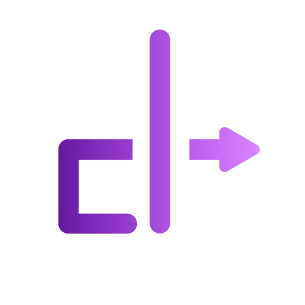

# clynamic

determined, diligent, distinguished.

We strive for software that is beautiful, that is the best we can do, that is open-source and that feels like being at home.

Find us on [our website](https://clynamic.net).

## What is clynamic?

Ignoring the previous pretentious tagline, I do believe in these values.
Open-source software and putting your heart into your work is something I
strongly align with. I also wish for a future where our work is not driven by profit, but passion and the drive to solve problems to improve our lives.

## Origin

The name "clynamic" consists of the word "dynamic" and a play on the fact that "c" and "l" together look similar to "d", which is also used in my own username.
Note that for this reason, our name is always written in lowercase.

I have founded this company to publish my software under an identity that does not include my name. I have a strong believe in personal privacy and I want to keep my personal life separate from my professional life.

We are a fully legal company, registered in the US under the name "clynamic LLC".

## Employees

| 
|---|
| [clragon](https://github.com/clragon) (CEO) |
